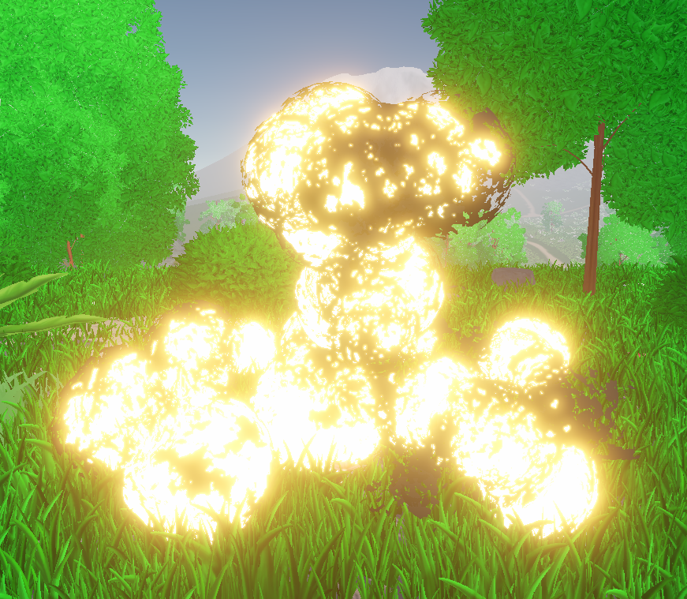

<h1>
  FPS Demo Project
</h1>

<h2>
  An experimental Unity FPS prototype focused on stylized visuals, elemental powers, and gameplay effects. 
   
  Built as a sandbox to test and iterate on VFX, shaders, and mechanics for a unique power-based combat experience.</h2>

<h2>
  All of the 3D models are made by me using Blender
</h2>

<h3>
  Explosion effect
</h3>

<h3>
  Overview of map
</h3>

